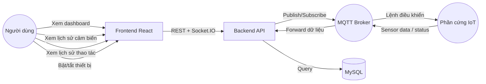
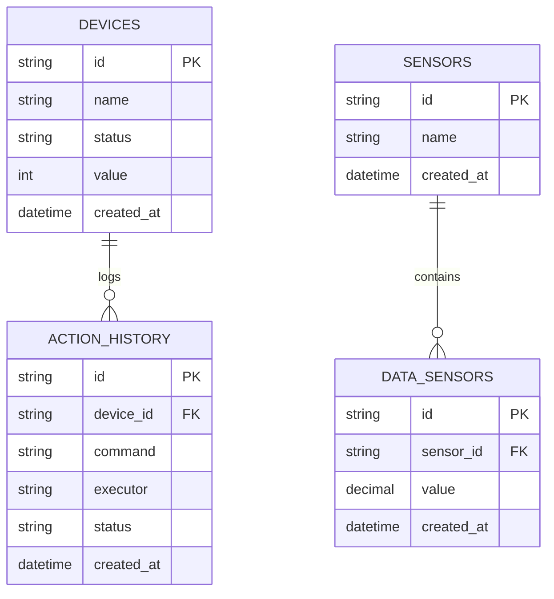
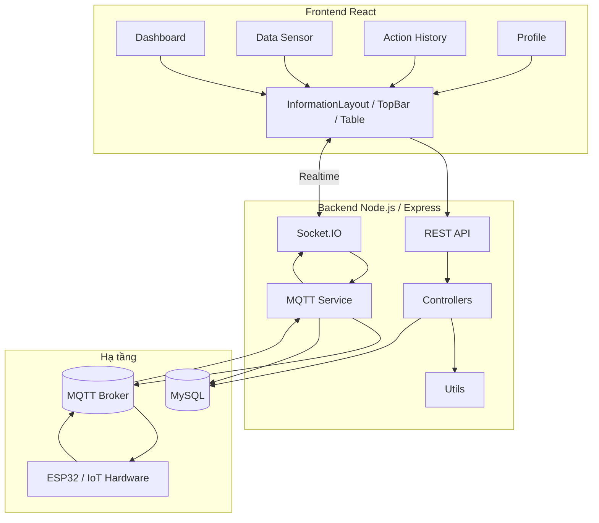
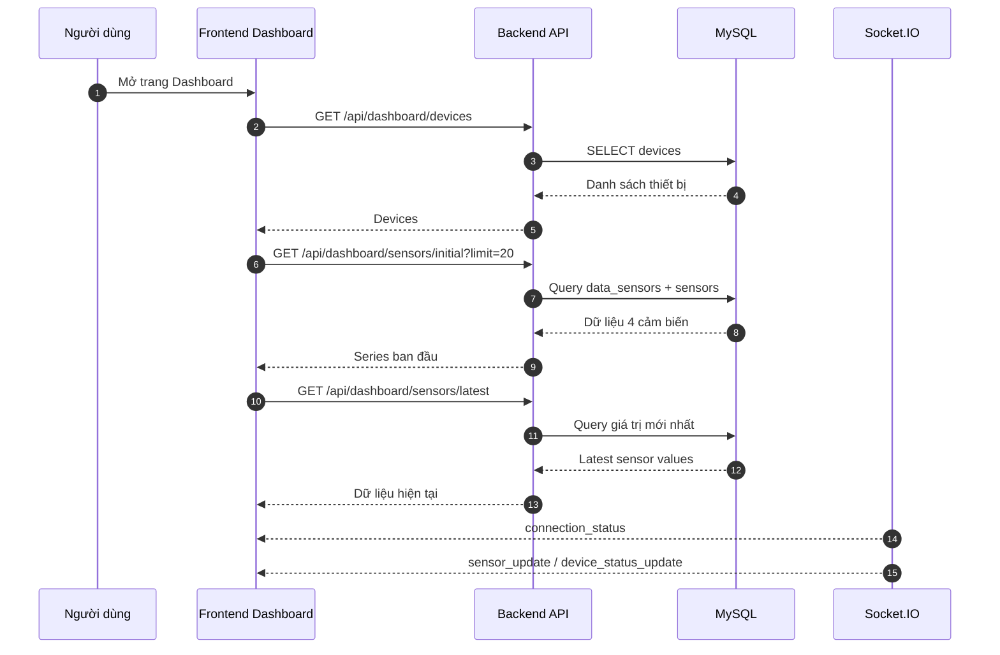
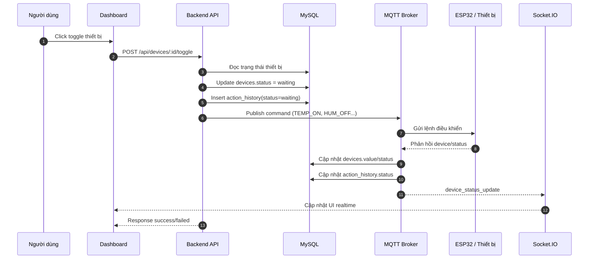
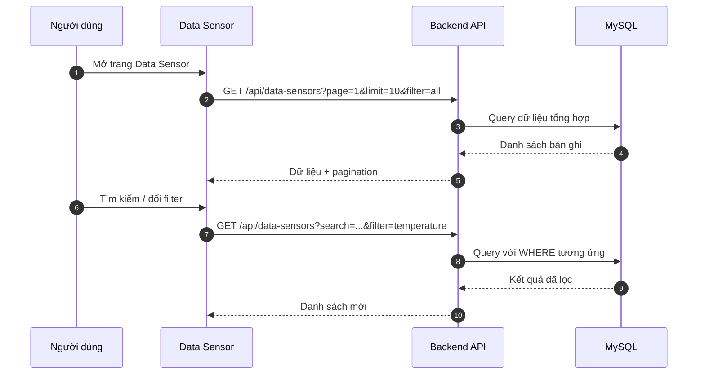
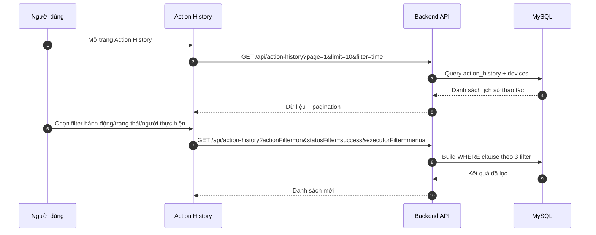
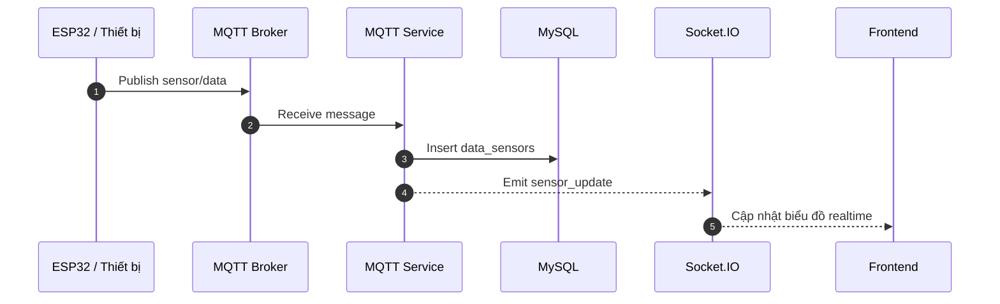

# Tài liệu thiết kế hệ thống IoT

## 1. Mục tiêu

Tài liệu này mô tả:
- Use cases chính của hệ thống.
- ERD ở mức logic cho các bảng dữ liệu cốt lõi.
- Sequence diagrams cho các luồng quan trọng trên các trang.
- Kiến trúc tổng thể của hệ thống.

Phạm vi được dựa trên các màn hình hiện có:
- Dashboard
- Data Sensor
- Action History
- Profile

## 2. Tổng Quan Hệ Thống

Hệ thống là một ứng dụng IoT gồm 4 lớp chính:
- Frontend web bằng React.
- Backend Node.js + Express.
- MySQL để lưu dữ liệu cảm biến và lịch sử thao tác.
- MQTT + Socket.IO để giao tiếp realtime với phần cứng.

Luồng dữ liệu chính:
- ESP32 / phần cứng gửi dữ liệu cảm biến và trạng thái thiết bị qua MQTT.
- Backend nhận MQTT, lưu vào MySQL và phát realtime qua Socket.IO.
- Frontend gọi REST API để lấy dữ liệu lịch sử và nhận realtime qua Socket.IO.
- Người dùng thao tác trên Dashboard để bật/tắt thiết bị, backend phát lệnh MQTT xuống phần cứng.

## 3. Use Cases

### 3.1 Tác nhân
- Người dùng
- Phần cứng IoT / ESP32
- MQTT Broker
- Backend API
- Cơ sở dữ liệu MySQL

### 3.2 Use Case chính
- Xem dashboard realtime.
- Xem danh sách thiết bị.
- Bật/tắt thiết bị từ dashboard.
- Xem biểu đồ dữ liệu cảm biến theo thời gian.
- Lọc/tìm kiếm dữ liệu cảm biến.
- Xem lịch sử thao tác thiết bị.
- Lọc theo tên thiết bị, hành động, trạng thái, người thực hiện, thời gian.
- Xem trạng thái kết nối hệ thống.
- Đồng bộ trạng thái thiết bị qua MQTT/Socket.IO.

### 3.3 Use Case Diagram

## 4. ERD

### 4.1 Các bảng chính

- `devices`: danh sách thiết bị điều khiển.
- `sensors`: danh mục cảm biến.
- `data_sensors`: dữ liệu đo được theo thời gian.
- `action_history`: lịch sử thao tác điều khiển thiết bị.

### 4.2 Quan hệ

- Một `sensor` có nhiều `data_sensors`.
- Một `device` có nhiều `action_history`.
- `action_history.device_id` tham chiếu đến `devices.id`.
- `data_sensors.sensor_id` tham chiếu đến `sensors.id`.

### 4.3 ERD Diagram

## 5. Kiến Trúc Hệ Thống

### 5.1 Architecture Diagram

### 5.2 Vai trò các thành phần

- Frontend React: hiển thị dashboard, lịch sử cảm biến, lịch sử thao tác, profile.
- REST API: trả dữ liệu lịch sử, danh sách thiết bị, biểu đồ, thống kê.
- Socket.IO: đẩy realtime trạng thái cảm biến, trạng thái thiết bị và kết nối.
- MQTT Service: nhận dữ liệu từ phần cứng và gửi lệnh điều khiển xuống thiết bị.
- MySQL: lưu dữ liệu lịch sử và các thực thể hệ thống.

## 6. Sequence Diagrams

### 6.1 Dashboard - tải dữ liệu ban đầu

### 6.2 Dashboard - bật/tắt thiết bị

### 6.3 Data Sensor - tải và lọc dữ liệu cảm biến

### 6.4 Action History - tải và lọc lịch sử thao tác

### 6.5 Realtime sensor update từ phần cứng

## 7. Mapping Luồng Theo Trang

### 7.1 Dashboard
- Tải danh sách thiết bị.
- Tải dữ liệu biểu đồ ban đầu.
- Nhận realtime sensor update.
- Nhận realtime device status update.
- Gửi lệnh toggle thiết bị.

### 7.2 Data Sensor
- Xem lịch sử cảm biến.
- Tìm kiếm theo thời gian hoặc giá trị.
- Lọc theo loại cảm biến.
- Sắp xếp tăng/giảm theo thời gian.

### 7.3 Action History
- Xem lịch sử điều khiển thiết bị.
- Tìm kiếm theo thời gian.
- Lọc theo tên thiết bị.
- Lọc riêng theo hành động.
- Lọc riêng theo trạng thái.
- Lọc riêng theo người thực hiện.
- Sắp xếp theo thời gian.

### 7.4 Profile
- Hiển thị thông tin tài khoản/người dùng.
- Không phải luồng nghiệp vụ dữ liệu chính của hệ thống IoT.

## 8. Ghi chú thiết kế

- `action_history` được ghi ngay khi người dùng bấm điều khiển để giữ vết thao tác.
- Trạng thái `waiting` được dùng khi backend đã nhận lệnh nhưng chưa xác nhận xong với phần cứng.
- Dữ liệu cảm biến được lưu theo từng bản ghi thời gian trong `data_sensors`.
- Realtime được ưu tiên qua Socket.IO, còn truy vấn lịch sử đi qua REST API.

## 9. Kết luận

Thiết kế hiện tại tách rõ 3 trách nhiệm:
- Trình bày dữ liệu ở frontend.
- Xử lý nghiệp vụ và đồng bộ ở backend.
- Giao tiếp phần cứng qua MQTT và realtime qua Socket.IO.

Cấu trúc này phù hợp cho việc mở rộng thêm sensor, thiết bị và các màn hình quản trị sau này.