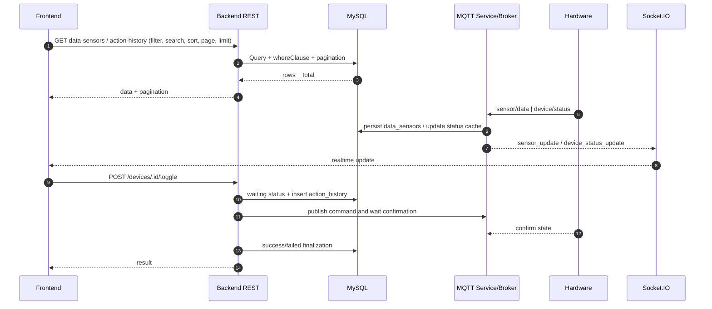

# Tài liệu kỹ thuật chi tiết các luồng chính

## 1. Phạm vi và nguồn tham chiếu

Tài liệu mô tả chính xác theo code hiện tại cho 4 luồng:
- Lịch sử Data Sensors.
- Action History.
- Khởi tạo và theo dõi cảm biến ở Dashboard.
- Bật/tắt thiết bị.

Nguồn chính:
- Frontend services/pages/components.
- Backend controllers/utils/services.

## 2. Luồng lịch sử Data Sensors

### 2.1 Entry points

- Frontend page: `GET` dữ liệu khi vào trang hoặc đổi state filter/search/sort/page/limit.
- API endpoint: `GET /api/data-sensors`.

Tham chiếu:
- [fe/src/pages/DataSensor.jsx](fe/src/pages/DataSensor.jsx)
- [fe/src/services/dataSensorService.js](fe/src/services/dataSensorService.js)
- [fe/src/components/InformationComponents/TopBar.jsx](fe/src/components/InformationComponents/TopBar.jsx)
- [fe/src/components/InformationComponents/Pagination.jsx](fe/src/components/InformationComponents/Pagination.jsx)
- [be/src/controllers/dataSensorController.js](be/src/controllers/dataSensorController.js)

### 2.2 Trạng thái và trigger ở frontend

State chính trên trang:
- `pagination`: `page`, `limit`, `total`, `totalPages`.
- `filters`: `search`, `filter`, `order`.

Trigger fetch:
- `useEffect` phụ thuộc `[pagination.page, pagination.limit, filters]`.

Hành vi UI:
- Đổi filter: reset `page = 1`.
- Đổi search: reset `page = 1`.
- Đổi limit: reset `page = 1`.
- Đổi sort: giữ page hiện tại.

Lưu ý quan trọng về search:
- `TopBar` ở trang này dùng `searchOnType = false`.
- Nút tìm kiếm đang được comment.
- Search hiện thực tế chạy khi người dùng bấm `Enter` trong input.

### 2.3 Format và chuẩn hóa request ở frontend

Dữ liệu gửi đi qua `buildQueryParams` chỉ giữ key có giá trị khác `undefined/null/''`.

Các key được gửi:
- `page`, `limit`, `search`, `filter`, `order`.

Xử lý format thời gian ở frontend:
- Chỉ khi `filter === 'time'` và có `search`.
- Nếu search đúng định dạng `DD/MM/YYYY HH:mm:ss` theo `isValidDateTime` thì convert thành `YYYY-MM-DD HH:mm:ss` bằng `formatDateTime`.
- Nếu không hợp lệ thì giữ nguyên chuỗi để backend tự fallback.

### 2.4 Query params và ràng buộc ở backend

Backend đọc query:
- `page`: ép số, min `1`, mặc định `1`.
- `limit`: ép số, min `1`, max `100`, mặc định `10`.
- `order`: chuẩn hóa bằng map `asc/desc`, sai giá trị thì fallback `DESC`.

### 2.5 Logic aggregate dữ liệu cảm biến

Backend không trả thẳng từng dòng raw cảm biến, mà aggregate theo từng giây:
- `GROUP BY DATE_FORMAT(ds.created_at, '%Y-%m-%d %H:%i:%s')`.
- Mỗi dòng output có `timestamp` + 4 cột `temperature/humidity/light/gas` bằng `MAX(CASE WHEN ... THEN ds.value END)`.

Ý nghĩa:
- Nếu cùng giây có nhiều bản ghi cùng sensor, lấy giá trị lớn nhất theo biểu thức `MAX`.

### 2.6 Toàn bộ các nhánh filter/search/time đang xử lý

Backend `buildWhereClause` xử lý lần lượt như sau:

1. Nếu `search` rỗng:
- Không có `WHERE`.
- Chỉ áp sort + pagination.

2. Nếu `filter` là một sensor số (`temperature/humidity/light/gas`) và `search` parse được số:
- Parse số hỗ trợ cả dấu `,` hoặc `.`.
- So sánh chính xác ở mức 1 chữ số thập phân:
  - `ROUND(CAST(column AS DECIMAL(18,6)), 1) = ROUND(?, 1)`.

3. Nếu `filter === 'time'`:
- Backend cố parse nhiều định dạng thời gian qua `parseTimeSearchKeyword`.
- Parse thành công: dùng so sánh chính xác theo cấp độ (day/hour/minute/second/monthYear/dayYear...).
- Parse thất bại: fallback `DATE_FORMAT(g.timestamp, '%Y-%m-%d %H:%i:%s') LIKE '%keyword%'`.

4. Nếu `filter` là sensor text-search hợp lệ (`temperature/humidity/light/gas`) nhưng không parse số:
- Dùng `CAST(g.<sensor> AS CHAR) LIKE '%keyword%'`.

5. Nếu `filter` không hợp lệ hoặc là `all`:
- OR-search trên cả 4 cột sensor bằng `CAST(... AS CHAR) LIKE`.
- Kèm tìm theo time:
  - Parse time thành công: thêm điều kiện time chính xác.
  - Parse time thất bại: dùng `DATE_FORMAT(... ) LIKE`.

### 2.7 Tất cả format thời gian backend đang hỗ trợ

Input được chấp nhận bởi `parseTimeSearchKeyword`:
- `DD/MM/YYYY`
- `DD/MM/YYYY HH`
- `DD/MM/YYYY HH:MM`
- `DD/MM/YYYY HH:MM:SS`
- `M/YYYY` hoặc `DD/YYYY`
- `M/YYYY HH`
- `M/YYYY HH:MM`
- `M/YYYY HH:MM:SS`
- `YYYY-MM-DD`
- `YYYY-MM-DD HH`
- `YYYY-MM-DD HH:MM`
- `YYYY-MM-DD HH:MM:SS`

Chiến lược map short format:
- Nếu phần đầu `1..12` thì hiểu là `month/year`.
- Nếu phần đầu `13..31` thì hiểu là `day/year`.

### 2.8 Pagination response và hiển thị

Backend trả:
- `pagination.page`, `limit`, `total`, `totalPages`, `offset`.

Frontend normalize:
- Ép `Number` cho các trường pagination.

UI pagination:
- Cho đổi `limit` trong `[5,10,20,50,100]`.
- Nút next/prev bị disable ở biên.
- Hiển thị range bản ghi `startItem-endItem / total`.

### 2.9 Format dữ liệu hiển thị ở bảng

- `temperature`: `formatNumber(value)` + `℃`.
- `humidity`: `formatNumber(value)` + `%`.
- `light`: `formatNumber(value)` + `%(Lux)`.
- `gas`: `formatNumber(value)` + `%(ppm)`.
- `timestamp`: `formatTime` thành `DD/MM/YYYY HH:mm:ss`.

Lưu ý `formatNumber`:
- Null/undefined/NaN -> `0`.
- Luôn 1 chữ số thập phân.

## 3. Luồng Action History

### 3.1 Entry points

- Frontend page: fetch khi đổi page/limit/search/sort/sensorFilter/actionFilter/statusFilter/executorFilter.
- API endpoint: `GET /api/action-history`.

Tham chiếu:
- [fe/src/pages/ActionHistory.jsx](fe/src/pages/ActionHistory.jsx)
- [fe/src/services/actionHistoryService.js](fe/src/services/actionHistoryService.js)
- [fe/src/utils/searchUtils.js](fe/src/utils/searchUtils.js)
- [be/src/controllers/actionHistoryController.js](be/src/controllers/actionHistoryController.js)

### 3.2 Trạng thái và trigger ở frontend

State filter gồm:
- `search`
- `sensorFilter`
- `actionFilter`
- `statusFilter`
- `executorFilter`
- `order`

Trigger fetch:
- `useEffect` phụ thuộc `[pagination.page, pagination.limit, filters]`.

Hành vi reset page:
- Đổi `sensorFilter`, `search`, `actionFilter`, `statusFilter`, `executorFilter`, `limit` -> reset về trang 1.

Search behavior:
- `TopBar` dùng `searchOnType = true`.
- Debounce `350ms`.
- Trang này đặt `forceSearchFilter = 'time'` nên search luôn truyền filter time.

### 3.3 Format và chuẩn hóa request ở frontend

Request gửi các key:
- `page`, `limit`, `search`, `filter`, `sensorFilter`, `actionFilter`, `statusFilter`, `executorFilter`, `order`.

Giá trị `filter` ở trang này luôn set cố định:
- `filter: 'time'`.

Chuẩn hóa search trong service:

1. Nếu `filter === 'time'` và `search` đúng `DD/MM/YYYY HH:mm:ss`:
- Convert sang `YYYY-MM-DD HH:mm:ss`.

2. Ngược lại nếu không đúng full datetime:
- Áp map từ tiếng Việt sang token hệ thống bằng `normalizeActionHistorySearch`.

Các từ đang map:
- `thành công` -> `success`
- `thất bại` -> `failed`
- `đang chờ` hoặc `chờ` -> `waiting`
- `hệ thống` -> `system`
- `người dùng` -> `user`
- `bật` -> `on`
- `tắt` -> `off`

### 3.4 Logic filter/search ở backend

Backend build `WHERE` theo thứ tự:

1. Search theo `filter`:
- Nếu `filter=time`:
  - Parse time thành công -> dùng điều kiện time chính xác.
  - Parse thất bại -> fallback `DATE_FORMAT(ah.created_at, '%Y-%m-%d %H:%i:%s') LIKE`.
- Nếu `filter` là key hợp lệ trong map (`name/action/status/user/time`) -> dùng đúng cột map.
- Nếu `filter` không hợp lệ -> OR-search toàn cục qua tên thiết bị, command, status, executor và time.

2. Sensor filter (`sensorFilter`):
- `humidity`: LIKE `%may bom%` hoặc `%máy bơm%`.
- `gas`: LIKE `%khoa gas%` hoặc `%khóa gas%`.
- `light`: LIKE `%quang cam%` hoặc `%quang cảm%`.
- `temperature`: LIKE `%nhiet ke%` hoặc `%nhiệt kế%`.
- `all` hoặc không hợp lệ: bỏ qua.

3. Action filter (`actionFilter`):
- `on`: command LIKE `%_ON` hoặc IN (`ON`, `TURN_ON`).
- `off`: command LIKE `%_OFF` hoặc IN (`OFF`, `TURN_OFF`).
- `all`: bỏ qua.

4. Status filter (`statusFilter`):
- Chỉ chấp nhận `success`, `error`, `pending`, `waiting`.
- Các giá trị khác bỏ qua filter status.

5. Executor filter (`executorFilter`):
- `auto`: executor in (`auto`, `system`, `bot`).
- `manual`: executor not in (`auto`, `system`, `bot`) hoặc null hoặc rỗng.
- `all`: bỏ qua.

Các điều kiện được nối bằng `AND`.

### 3.5 Pagination/sort và output

Pagination:
- `page >= 1`.
- `limit` trong `[1,100]`.
- `offset = (page-1)*limit`.

Sort:
- `order` chuẩn hóa bởi `getNormalizedSortOrder` (`ASC`/`DESC`, fallback `DESC`).

Output row:
- Có `device_name`, `command`, `executor`, `status`, `timestamp`.
- Tạo thêm trường `value`:
  - `ON` nếu command thuộc nhóm ON.
  - `OFF` nếu command thuộc nhóm OFF.
  - `NULL` nếu command khác.

### 3.6 Format hiển thị Action History

- Cột thời gian: `formatTime` -> `DD/MM/YYYY HH:mm:ss`.
- Cột hành động: hiển thị `Bật/Tắt` theo `value`.
- Cột status: icon/badge theo loại status.
- Cột executor: hiển thị icon user/bot và tên đã format.

### 3.7 Ghi chú mismatch cần biết

- API filter status hỗ trợ `error`, nhưng luồng toggle hiện ghi trạng thái lỗi là `failed` trong `devices` và `action_history`.
- Điều này có thể làm dropdown `Lỗi` không match dữ liệu `failed` nếu DB đang lưu `failed`.

## 4. Luồng khởi tạo và theo dõi cảm biến trên Dashboard

### 4.1 Entry points

- Khi mount trang Dashboard:
  - Gọi danh sách thiết bị.
  - Gọi dữ liệu chart ban đầu và latest sensor values.
  - Kết nối Socket.IO và subscribe các event.

Tham chiếu:
- [fe/src/pages/Dashboard.jsx](fe/src/pages/Dashboard.jsx)
- [fe/src/hooks/useSocket.jsx](fe/src/hooks/useSocket.jsx)
- [fe/src/services/socketService.js](fe/src/services/socketService.js)
- [be/src/controllers/dashboardController.js](be/src/controllers/dashboardController.js)
- [be/src/services/mqttService.js](be/src/services/mqttService.js)
- [be/src/server.js](be/src/server.js)

### 4.2 Luồng khởi tạo dữ liệu dashboard

Frontend:
1. `fetchDevices()` -> `GET /api/dashboard/devices`.
2. `fetchInitialChartData()`:
- Đồng thời gọi:
  - `GET /api/dashboard/sensors/initial?limit=20`
  - `GET /api/dashboard/sensors/latest`
- Set dữ liệu chart ban đầu.
- Set giá trị hiện tại của 4 sensor.
- Dù lỗi vẫn set `chartDataLoaded = true` để không chặn realtime.

Backend:
- `getDeviceList`: trả danh sách devices sort theo `created_at ASC`.
- `getInitialSensorData`: query theo từng sensor type, lấy `limit` điểm mới nhất rồi reverse để thành timeline tăng dần.
- `getLatestSensorValues`: lấy mỗi sensor 1 điểm mới nhất.

### 4.3 Luồng theo dõi realtime sensor

Backend MQTT service:
- Subscribe `sensor/data`, `device/status`, `device/sync`.
- Với `sensor/data`:
  - Parse payload theo single hoặc batch field.
  - Normalize sensor type (`temperature/humidity/light/gas`, hỗ trợ alias `dust->gas`).
  - Lưu vào `data_sensors`.
  - Emit Socket.IO event `sensor_update`.

Frontend Socket service:
- Nhận `sensor_update`.
- Normalize payload type/value/timestamp.
- Callback `onSensorData` của Dashboard cập nhật:
  - giá trị hiện tại sensor.
  - thêm điểm mới vào chart.
  - chỉ giữ tối đa 20 điểm/chart.

### 4.4 Theo dõi trạng thái kết nối

Backend:
- Mỗi 2 giây emit `connection_status` gồm:
  - `mqttConnected`
  - `hardwareConnected`
  - `success`
  - `message`

Frontend:
- Theo dõi event `connection_status`, `connect`, `disconnect`, `connect_error`.
- Suy ra trạng thái tổng hợp `canControlDevices`.
- Banner hiển thị một trong các trạng thái:
  - Mất Socket.
  - Mất MQTT.
  - Mất kết nối thiết bị.
  - Đã kết nối.

### 4.5 Format dữ liệu hiển thị dashboard

- Sensor value card: `formatNumber` 1 chữ số thập phân.
- Chart series:
  - Lọc điểm thiếu timestamp.
  - Ép `Number` value.
  - Bỏ điểm NaN.
- Tên thiết bị:
  - map display name theo `mappings`.
  - chuẩn hóa hiển thị bằng `formatName`.

## 5. Luồng bật/tắt thiết bị

### 5.1 Entry points

- Frontend call: `POST /api/devices/:id/toggle`.
- Backend xử lý trong `deviceController.toggleDevice`.

Tham chiếu:
- [fe/src/pages/Dashboard.jsx](fe/src/pages/Dashboard.jsx)
- [fe/src/components/ToggleCard.jsx](fe/src/components/ToggleCard.jsx)
- [fe/src/services/deviceService.js](fe/src/services/deviceService.js)
- [be/src/controllers/deviceController.js](be/src/controllers/deviceController.js)
- [be/src/services/mqttService.js](be/src/services/mqttService.js)

### 5.2 Điều kiện chặn ở frontend trước khi gọi API

Frontend chỉ cho toggle khi:
- `socketConnected = true`
- `mqttConnected = true`
- `hardwareConnected = true`

Nếu không thỏa:
- Alert: mất kết nối thiết bị.
- Không gửi request.

`ToggleCard` cũng tự chặn khi state `waiting` hoặc `disconnected`.

### 5.3 Chuỗi xử lý backend khi toggle

1. Kiểm tra thiết bị tồn tại theo `id`.
- Không có -> HTTP 404.

2. Tính lệnh điều khiển:
- Đọc `currentValue`.
- Suy ra `nextValue` (đảo 0/1).
- Resolve command prefix từ tên thiết bị.
- Build command: `<PREFIX>_ON` hoặc `<PREFIX>_OFF`.

3. Đánh dấu trạng thái chờ:
- `UPDATE devices.status = waiting`.
- `INSERT action_history(status = waiting, executor = user, command = ...)`.

4. Gửi lệnh MQTT và chờ xác nhận phần cứng.
- Nếu MQTT service không sẵn sàng:
  - Update `devices.status = failed`.
  - Update `action_history.status = failed`.
  - Trả HTTP 200 với `success: true`, `data.status = failed`, giữ `value` cũ.

5. Khi MQTT service có sẵn:
- Dùng `sendCommandAndWaitWithReconnect`.
- Thành công:
  - Update `devices.value = nextValue`, `devices.status = success`.
  - Update `action_history.status = success`.
  - Trả HTTP 200 `success: true`, `data.status = success`.
- Thất bại:
  - Update cả 2 bảng về `failed`.
  - Trả HTTP 200 `success: true`, `data.status = failed` + message lỗi.

### 5.4 Tất cả trường hợp lỗi/retry đã xử lý trong MQTT service

`sendCommandAndWaitWithReconnect` xử lý:

1. Mất kết nối trước thao tác:
- Chờ reconnect tối đa `reconnectTimeoutMs` (mặc định 10s).
- Quá timeout -> lỗi `MQTT_RECONNECT_TIMEOUT`.

2. Gửi lệnh xong nhưng mất kết nối trong lúc chờ xác nhận:
- Bắt mã lỗi `MQTT_DISCONNECTED_DURING_WAIT` hoặc `MQTT_NOT_CONNECTED`.
- Thử reconnect lại trong 10s.
- Nếu reconnect thành công -> gửi lại và chờ thêm một lần.

3. Không nhận xác nhận trạng thái từ hardware kịp timeout:
- Lỗi `HARDWARE_CONFIRM_TIMEOUT`.

4. Điều kiện xác nhận state:
- Match theo key trạng thái phần cứng map từ device name (`temp_led`, `hum_led`, `ldr_led`, `gas_led`).
- Nếu trạng thái mới nhận đúng target thì resolve waiter.

### 5.5 Hành vi hiển thị sau khi toggle ở frontend

- Trước call API: optimistic `status=waiting`.
- API trả `success=true`:
  - Cập nhật lại `value/status` từ response.
  - Nếu `status=failed` và có message -> alert.
- Request lỗi network/backend unreachable:
  - Alert lỗi kết nối backend.
  - Revert về `value` cũ và set `status=failed`.

## 6. Tóm tắt format và chuẩn dữ liệu quan trọng

### 6.1 Format thời gian

Frontend có 2 hướng:
- Hiển thị: luôn `DD/MM/YYYY HH:mm:ss` qua `formatTime`.
- Search time full datetime: `DD/MM/YYYY HH:mm:ss` có thể convert sang `YYYY-MM-DD HH:mm:ss`.

Backend parse time rộng hơn frontend:
- Nhận được cả dạng ngày, giờ, phút, giây, month/year, day/year, và YMD.

### 6.2 Format số

- Search số sensor hỗ trợ `,` hoặc `.` ở backend.
- So sánh numeric filter ở mức làm tròn 1 số thập phân.
- Hiển thị sensor value luôn 1 số thập phân.

### 6.3 Pagination chuẩn

- Mọi list API đều giới hạn `limit <= 100`.
- `page` tối thiểu là `1`.
- Frontend reset page về `1` khi đổi filter/search/limit.

### 6.4 Quy ước status/action

- Action chuẩn hóa hiển thị: ON/OFF -> Bật/Tắt.
- Toggle flow ghi status điển hình: `waiting`, `success`, `failed`.
- Action history status filter hiện cho phép `success/error/pending/waiting`.

## 7. Sequence tổng hợp nhanh

## 8. Gợi ý kiểm thử đúng với logic hiện tại

- Data Sensor:
  - Test `filter=time` với các format partial/full.
  - Test numeric search với `31,5` và `31.5`.
  - Test filter `all` khi search keyword thời gian.

- Action History:
  - Test kết hợp `sensorFilter + actionFilter + statusFilter + executorFilter`.
  - Test search từ khóa tiếng Việt (`bật`, `hệ thống`, `thành công`).
  - Test trường hợp `status=failed` với dropdown status hiện tại.

- Dashboard:
  - Test tình huống API initial lỗi nhưng realtime vẫn hoạt động.
  - Test mất kết nối Socket/MQTT/hardware để kiểm tra banner trạng thái.

- Toggle Device:
  - Test hardware phản hồi thành công.
  - Test timeout xác nhận hardware.
  - Test MQTT reconnect timeout.
  - Test backend unreachable từ frontend.
